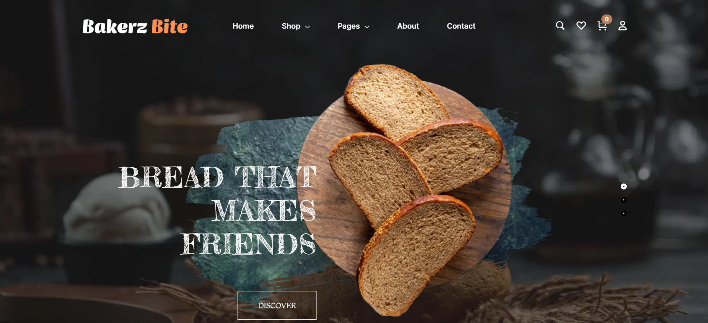
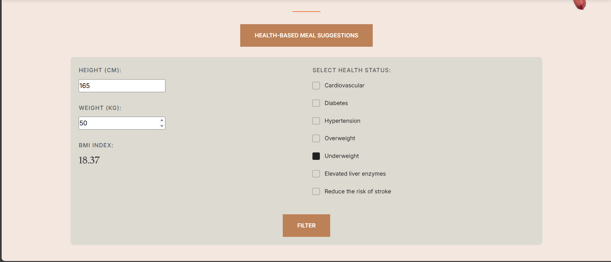
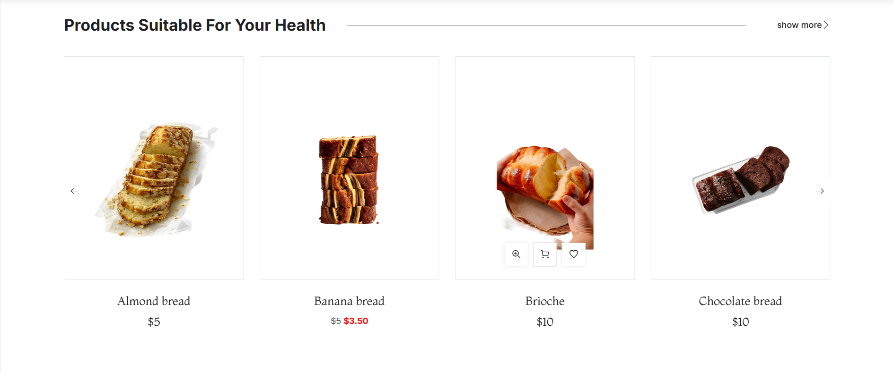
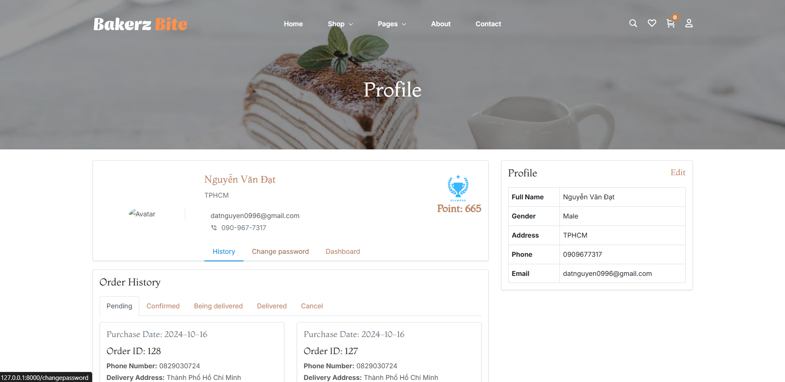
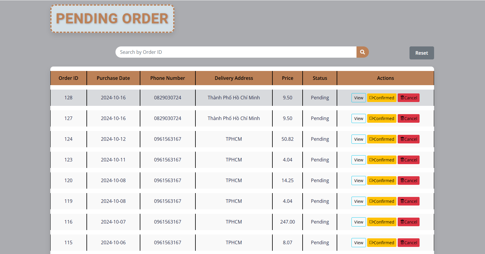
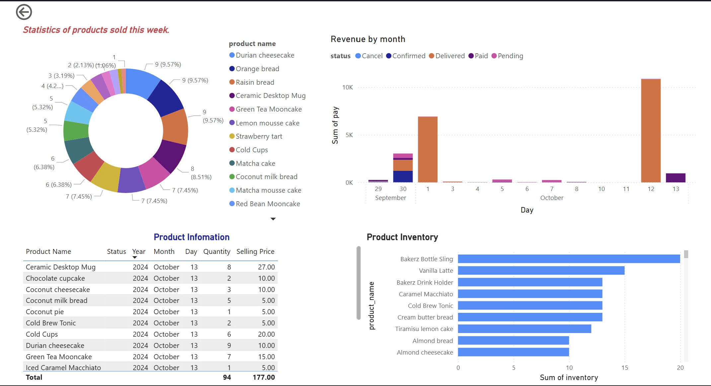
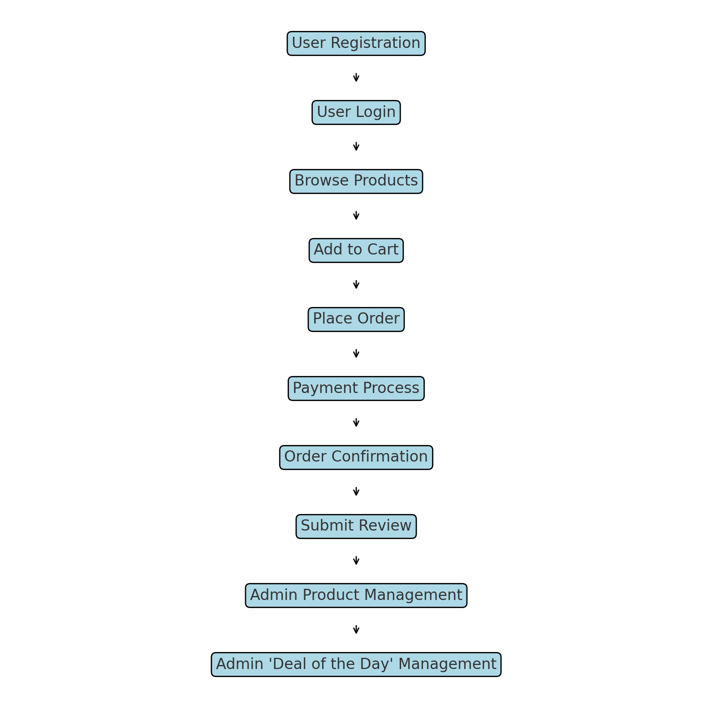
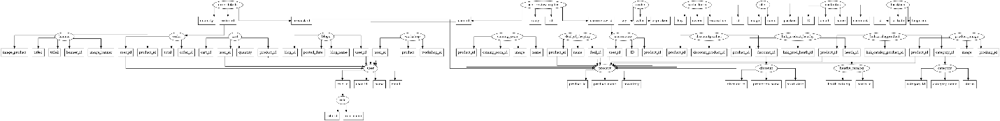

# Bakerz Bite Showcase

Public portfolio repository for the **Bakerz Bite** project.

This repository is designed for recruiters, interviewers, and reviewers who want to quickly understand the project without accessing the private source code.

## Overview

Bakerz Bite is a bakery e-commerce web application built with Laravel. The project combines customer shopping flows, health-based product suggestions, order processing, reward-based experiences, and admin-side management tools in one system.

The real production source code is kept private. This showcase focuses on the product, architecture, and implementation highlights.

## Highlights

- Customer-facing bakery storefront with category-based browsing
- Product detail pages with image galleries and reviews
- Health-based meal suggestion flow using BMI and selected health conditions
- Deal of the Day and Coming Soon product areas
- Customer profile, order tracking, and reward-based workshop access
- Admin-side product, order, discount, and promotional management
- Power BI integration for dashboard reporting
- VNPay integration for payments
- CI/CD deployment to server using GitHub Actions

## Links

- Live Demo: [http://103.153.72.209/](http://103.153.72.209/)
- Project Demo Video: [https://www.youtube.com/watch?v=FIMq_x9z6Uc&t=4s](https://www.youtube.com/watch?v=FIMq_x9z6Uc&t=4s)
- Featured Project Article: [https://aptechvietnam.com.vn/san-pham-hoc-vien/website-ban-banh-va-ca-phe-truc-tuyen-tien-loi-bakerz-bite/](https://aptechvietnam.com.vn/san-pham-hoc-vien/website-ban-banh-va-ca-phe-truc-tuyen-tien-loi-bakerz-bite/)

## Tech Stack

- Backend: Laravel 11, PHP 8.2
- Frontend: Blade, Bootstrap, jQuery
- Database: MySQL / MariaDB
- Reporting: Power BI Embed
- Payment: VNPay
- Maps: Embedded map on contact page
- Deployment: GitHub Actions, SSH-based server deployment

## My Contributions

- Designed and implemented major customer-facing pages, including the homepage and product presentation flows
- Built core shopping-related features such as category browsing, cart data handling, and order history
- Developed the health-based product suggestion experience based on BMI and selected health conditions
- Implemented promotional and engagement modules such as Deal of the Day, best-seller content, Workshop, Blog, Our Chef, Coming Soon, and Bakerz Bite Rewards
- Contributed to admin-side functionality, including Power BI reporting, healthy-type management, and product quantity management
- Supported feature integration, UI behavior fixes, CI/CD deployment flow, and overall project completion across both client and admin areas

## Deployment Workflow

- The project uses GitHub Actions for deployment automation
- On push to the `master` branch, a workflow connects to the server via SSH and updates the deployed application
- The deployment flow includes pulling the latest code and clearing Laravel configuration and application cache

## Recognition

- Bakerz Bite was featured by Aptech Vietnam as one of the representative student projects for Semester 1
- Public article: [Website bán bánh và cà phê trực tuyến tiện lợi - Bakerz Bite](https://aptechvietnam.com.vn/san-pham-hoc-vien/website-ban-banh-va-ca-phe-truc-tuyen-tien-loi-bakerz-bite/)

## Screenshots

### Home Hero

### Health-Based Suggestion Form

### Health-Based Suggestion Results

### Customer Profile And Orders

### Admin Order Management

### Power BI Dashboard

## Architecture And Database

### System Flow

### ER Diagram

## Repository Structure

- `docs/screenshots`: UI screenshots used in this showcase
- `docs/diagrams`: architecture and ERD images
- `docs/features`: feature summaries
- `docs/api`: public-facing route and API notes
- `docs/demo`: links for live demo or video demo
- `docs/deployment`: stack and deployment notes
- `portfolio`: project summary, responsibilities, and technical reflections

## What Is Public Here

- Product summary
- Feature overview
- Architecture and ERD diagrams
- Selected screenshots
- Portfolio and presentation materials

## What Is Not Included

- Full backend source code
- Full frontend source code
- Environment files or secrets
- Production configuration
- Internal implementation details that belong to the private repository

## Private Source Code Note

The full source code for Bakerz Bite is private.

If you are a recruiter, interviewer, or reviewer and would like a walkthrough of the implementation, I can provide:

- a live demo
- a guided screen-sharing session
- additional implementation details upon request

## Supporting Documents

- Feature summaries: [docs/features](docs/features)
- Architecture notes: [docs/diagrams](docs/diagrams)
- Project portfolio notes: [portfolio](portfolio)
- Live demo details: [docs/demo/demo-link.md](docs/demo/demo-link.md)
- Video demo details: [docs/demo/video-link.md](docs/demo/video-link.md)
